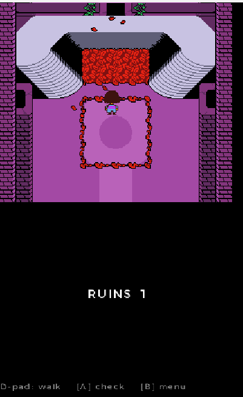
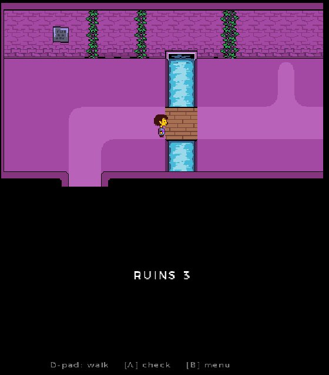
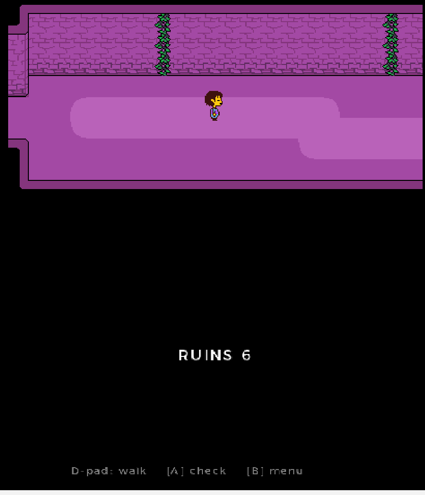
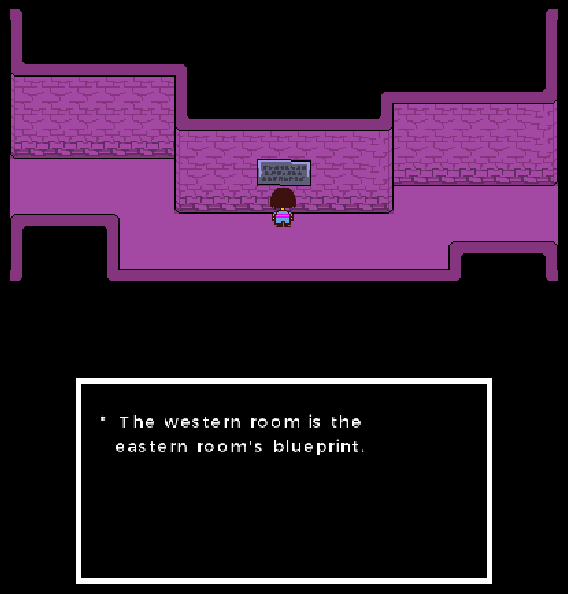
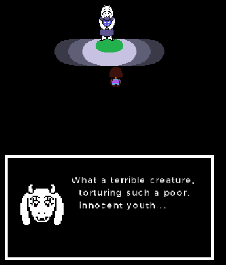
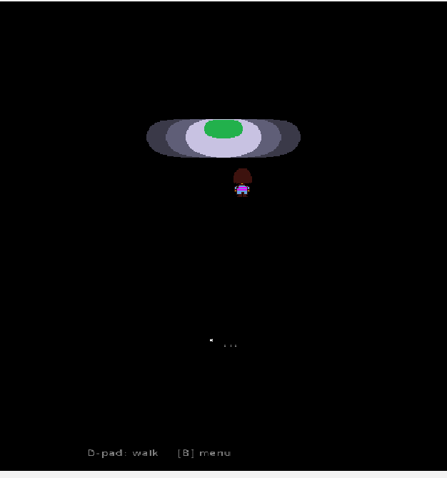
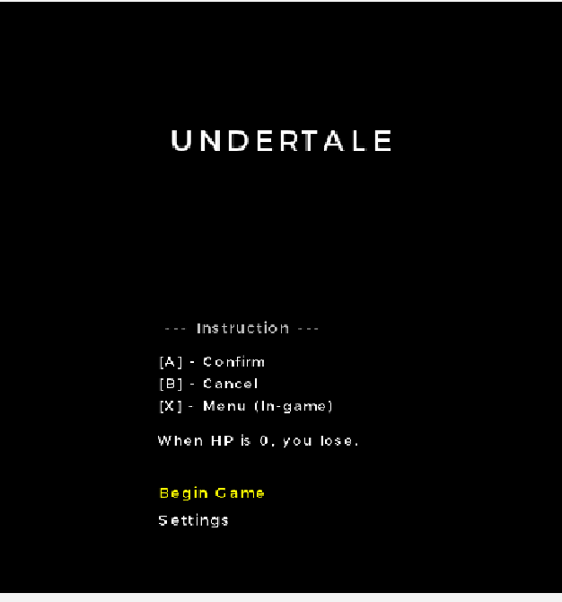
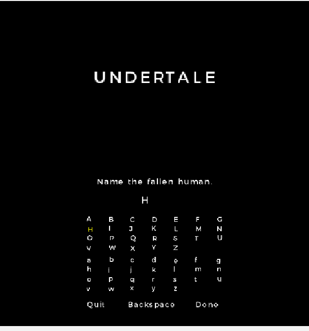
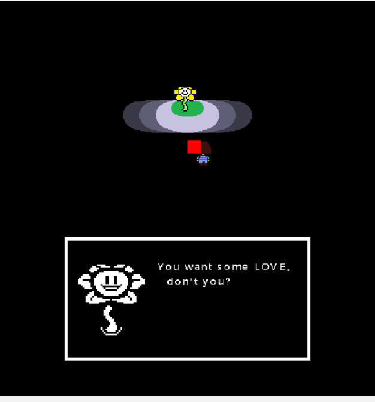
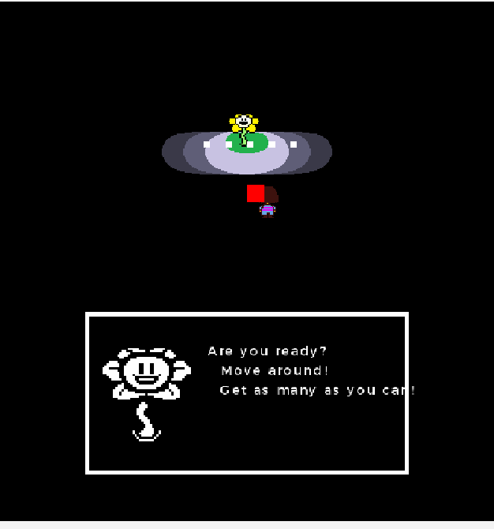

# UNDERTALE on the 3DS

im rebuilding undertale so it runs on an actual nintendo 3ds. two screens, real pixels, running
on homebrew.

-27AE60)

 

*flowey, on hardware. the world is up top, the talking happens on the bottom screen*

> ⚠️ **this is nowhere near finished.** its a hobby project and still really early. right now you
> got the intro, the menu, a chunk of the ruins and the flowey + toriel bit. no battle system past
> flowey, no saving, and toriel is the only character in so far. so ya, dont expect to play the
> whole game yet.

---

## wait what is this

you cant just turn the PC copy of undertale into a 3ds game, theres no button for that. undertale
was made in gamemaker and the 3ds cant run gamemaker stuff. so instead im just rebuilding the game
myself in C and feeding it the real sprites and sound from my own copy.

im doing it one screen at a time so theres always something working to look at, and if one part
breaks it doesnt take everything else down with it.

none of the actual undertale files go in here (see [legal](#legal)), this repo is just my code. you
bring your own copy of the game.

## screenshots

all real, straight off the two 3ds screens (running in the azahar emulator).

**the ruins so far**

|  |  |  |
|:--:|:--:|:--:|
|  |  |  |
| the leaf pile room | the little bridge | long hallway |
|  |  |  |
| reading a sign | **toriel shows up!** | walking around |

**the start of the game**

|  |  |
|:--:|:--:|
|  |  |
| the title + how to play | naming the fallen human |
|  |  |
| flowey being flowey | *"Are you ready? Move around!"* |

## the two screen thing

the whole point of doing it on a 3ds is you get two screens, so im actually using both instead of
cramming everything on one.

- **top screen:** just the game world, kept nice and clean.
- **bottom screen:** all the talking, menus and inventory. and since its the touch screen you can
  tap the menus which is pretty handy.

## can i play it

not really yet, so im not gonna post build/install steps for now. theres just not enough here to
be worth it, youd basically get a demo. once its actually playable ill write up how to build it and
put it on a real 3ds. for now this is more of a "heres my progress" kinda thing.

## whats done / whats next

**working:**
- [x] the intro story slides
- [x] title screen + the full naming screen (with all the name easter eggs like sans, asgore...)
- [x] walking around, animated, with proper collision so you dont walk through walls
- [x] a bunch of the ruins rooms hooked together with doors
- [x] the whole flowey intro (the friendliness pellets trap) and toriel saving you
- [x] a basic battle box (the little arena where you dodge stuff)

**not yet:**
- [ ] the rest of the ruins + actual npcs (toriel is the only one in right now)
- [ ] a real battle system (fight / act / item / mercy)
- [ ] saving
- [ ] music in more places, and the real undertale font (using a placeholder for now)

## legal

undertale is © toby fox, im not affiliated with him at all, this is just a fan thing i make for fun.
none of the games sprites, music or rooms are in this repo, they stay on my pc. you need to own
undertale yourself to actually build a playable version.

## license

my code in here is MIT (see [LICENSE](LICENSE)). that only covers the code i wrote, it does NOT give
you any rights to undertale itself, thats all toby fox's.

## support

if you like this and wanna help me keep working on it you can toss me a couple bucks on ko-fi, no
pressure at all. thanks either way :)

